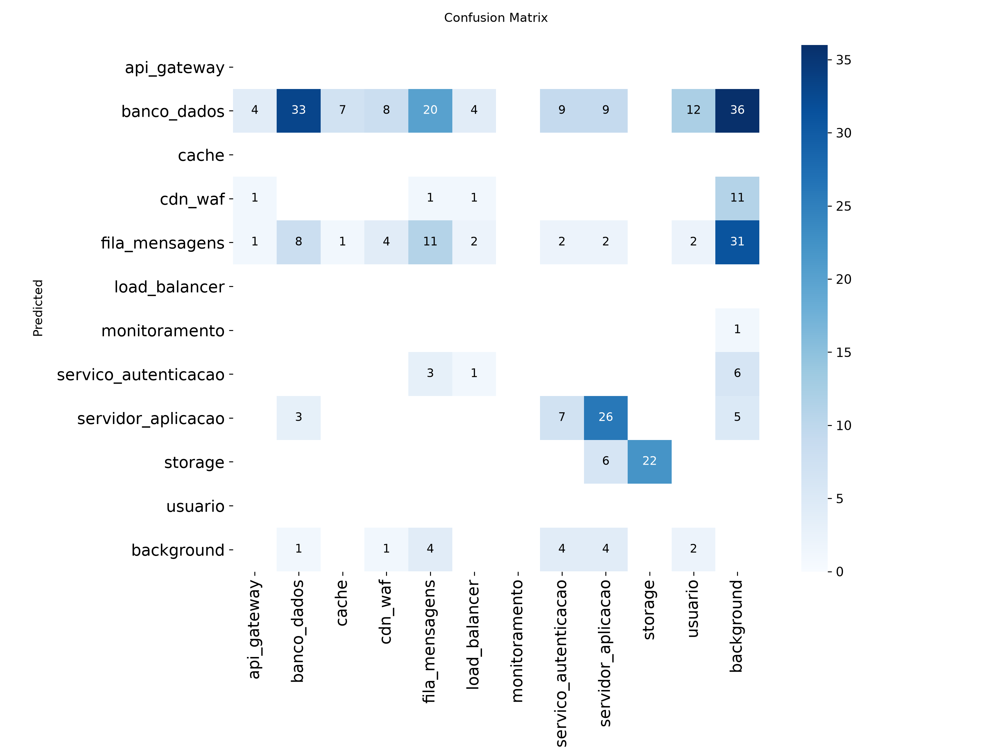

# 🛡️ STRIDE Threat Modeler

> Envie a **imagem de um diagrama de arquitetura** e receba automaticamente um
> **Relatório de Modelagem de Ameaças** baseado na metodologia **STRIDE**.

[](https://github.com/Uill2110/HackatonFiap2026/actions/workflows/ci.yml)


Projeto do **Hackathon FIAP POS TECH — Fase 5** · empresa fictícia **FIAP
Software Security**. O objetivo é validar a viabilidade de uma feature de
**detecção supervisionada de ameaças** a partir de diagramas de arquitetura.

---

## Sumário

- [Como funciona](#como-funciona)
- [Principais recursos](#principais-recursos)
- [Setup](#setup)
- [Provedor de LLM (Claude ou OpenAI)](#provedor-de-llm-claude-ou-openai)
- [Modelo: preparação, treino e avaliação](#modelo-preparação-treino-e-avaliação)
- [Uso](#uso)
- [Estrutura do projeto](#estrutura-do-projeto)
- [Metodologia STRIDE](#metodologia-stride)
- [Documentação](#documentação)
- [Autores](#autores)

---

## Como funciona

O sistema é um **pipeline de 4 etapas** — a detecção é local (visão
computacional) e a IA generativa entra apenas no final, para o texto do relatório:

```
   [ diagrama de arquitetura ]
              │
              ▼
   1. DETECÇÃO (YOLOv8)          → localiza componentes: banco, API, storage, fila…
              │
              ▼
   2. BASE STRIDE                → mapeia cada componente → ameaças + contramedidas
              │
              ▼
   3. LLM (Claude ou OpenAI)     → resumo executivo + recomendações priorizadas
              │
              ▼
   4. RELATÓRIO                  → Markdown estruturado + exportação em PDF
```

## Principais recursos

- 🔎 **Detecção supervisionada (YOLOv8)** de componentes de arquitetura, treinada
  com diagramas sintéticos gerados a partir de ícones AWS.
- 🧠 **Base de conhecimento STRIDE** com 11 componentes → ameaças e contramedidas.
- 🔀 **Multi-provedor de LLM** — gere o relatório com **Claude (Anthropic)** ou
  **GPT (OpenAI)**, trocando apenas uma variável de ambiente.
- 📄 **Relatório em Markdown e PDF**.
- 🖥️ **Interface Streamlit** redesenhada (tema de console de segurança) com painel
  de métricas, chips dos componentes detectados e **histórico de análises recentes**.
- 🔌 **API FastAPI** (`/analyze`) e **CLI** para automação.
- 📊 **Avaliação do modelo** com métricas (mAP, precisão/recall, matriz de confusão).
- ✅ **Testes automatizados + CI** (GitHub Actions).

## Setup

Este projeto usa [uv](https://docs.astral.sh/uv/) para gerenciar o ambiente.

```bash
uv venv                       # cria o .venv
# ative: source .venv/bin/activate  (Windows: .venv\Scripts\activate)

# Instale o torch antes do requirements.txt. Com GPU NVIDIA, use um índice CUDA
# (ex.: cu124); sem GPU, use o índice CPU:
uv pip install torch torchvision --index-url https://download.pytorch.org/whl/cpu

uv pip install -r requirements.txt
cp .env.example .env          # preencher as chaves (ver seção de provedor)
```

> Com pip tradicional, troque `uv pip install` por `pip install` e `uv venv` por
> `python -m venv .venv`.

## Provedor de LLM (Claude ou OpenAI)

O texto do relatório pode ser gerado pela **Anthropic (Claude, padrão)** ou pela
**OpenAI (GPT)** — quem não tem conta na Anthropic pode usar a OpenAI. A escolha é
por variável de ambiente, **sem alterar código**.

| Variável | Quando usar | Padrão |
|---|---|---|
| `LLM_PROVIDER` | `anthropic` ou `openai` | `anthropic` |
| `ANTHROPIC_API_KEY` | `LLM_PROVIDER=anthropic` | — |
| `OPENAI_API_KEY` | `LLM_PROVIDER=openai` | — |
| `ANTHROPIC_MODEL` / `OPENAI_MODEL` | opcional, sobrescreve o modelo | `claude-sonnet-4-6` / `gpt-4o` |

```bash
# .env — exemplo usando OpenAI
LLM_PROVIDER=openai
OPENAI_API_KEY=sk-...
```

Guia completo em [`docs/provedores_llm.md`](docs/provedores_llm.md).

## Modelo: preparação, treino e avaliação

A detecção usa um **YOLOv8 treinado**. Como o dataset público de ícones AWS tem um
ícone por imagem, geramos **diagramas sintéticos** (vários ícones num canvas) para
o modelo aprender a localizar múltiplos componentes:

```bash
python -m model.download_dataset      # 1. baixa os ícones AWS (Roboflow)
python -m model.generate_synthetic    # 2. gera os diagramas sintéticos + data.yaml
python -m model.train --device 0      # 3. treina (use --device cpu sem GPU NVIDIA)
python -m model.evaluate              # 4. avalia (mAP, precisão/recall, matriz de confusão)
```

Os pesos vão para `MODEL_WEIGHTS_PATH` (padrão `model/weights/best.pt`), usado
automaticamente na inferência.

### Resultados

A avaliação (`model/evaluate.py`) gera métricas e gráficos. Resultados e discussão
completos em [`docs/resultados.md`](docs/resultados.md).

<p align="center">
  
</p>

> No Windows, o treino usa `--workers 0` por padrão (evita erro de paging file com
> as DLLs do CUDA). `model/class_mapping.py` traduz as classes AWS para as chaves
> da knowledge_base.

## Uso

> Rode **sempre a partir da raiz do projeto**, com o ambiente ativo. Os módulos
> usam imports absolutos (`stride`, `model`).

```bash
# Interface web (Streamlit)
streamlit run app/streamlit_app.py

# API (FastAPI) — POST /analyze, POST /analyze/download, GET /health
uvicorn api.main:app --reload

# Relatório via linha de comando (--pdf também exporta em PDF)
python -m stride.report_generator --input data/test/arquitetura_aws.png --pdf

# Detecção isolada (apenas inferência)
python -m model.predict --image data/test/arquitetura_aws.png
```

## Estrutura do projeto

```
├── model/     detecção supervisionada (dataset → treino → avaliação → inferência YOLOv8)
├── stride/    base de conhecimento STRIDE, provedor de LLM e gerador de relatório
├── api/       API FastAPI
├── app/       interface Streamlit
├── tests/     testes automatizados (pytest)
├── docs/      documentação, resultados e exemplos de relatório
└── data/      imagens de arquitetura (brutas, anotadas, testes)
```

## Metodologia STRIDE

| Letra | Ameaça | Descrição |
|---|---|---|
| **S** | Spoofing | Falsificação de identidade |
| **T** | Tampering | Adulteração de dados |
| **R** | Repudiation | Negação de ações realizadas |
| **I** | Information Disclosure | Exposição indevida de dados |
| **D** | Denial of Service | Indisponibilidade do sistema |
| **E** | Elevation of Privilege | Escalada de privilégios |

## Documentação

| Documento | Conteúdo |
|---|---|
| [`docs/fluxo_desenvolvimento.md`](docs/fluxo_desenvolvimento.md) | Fluxo de desenvolvimento e decisões técnicas |
| [`docs/resultados.md`](docs/resultados.md) | Avaliação do modelo: métricas, matriz de confusão e discussão |
| [`docs/provedores_llm.md`](docs/provedores_llm.md) | Como usar Claude ou OpenAI |

## Autores

Trabalho desenvolvido para o **Hackathon FIAP POS TECH — Fase 5**.

- _(adicione aqui os integrantes do grupo)_
